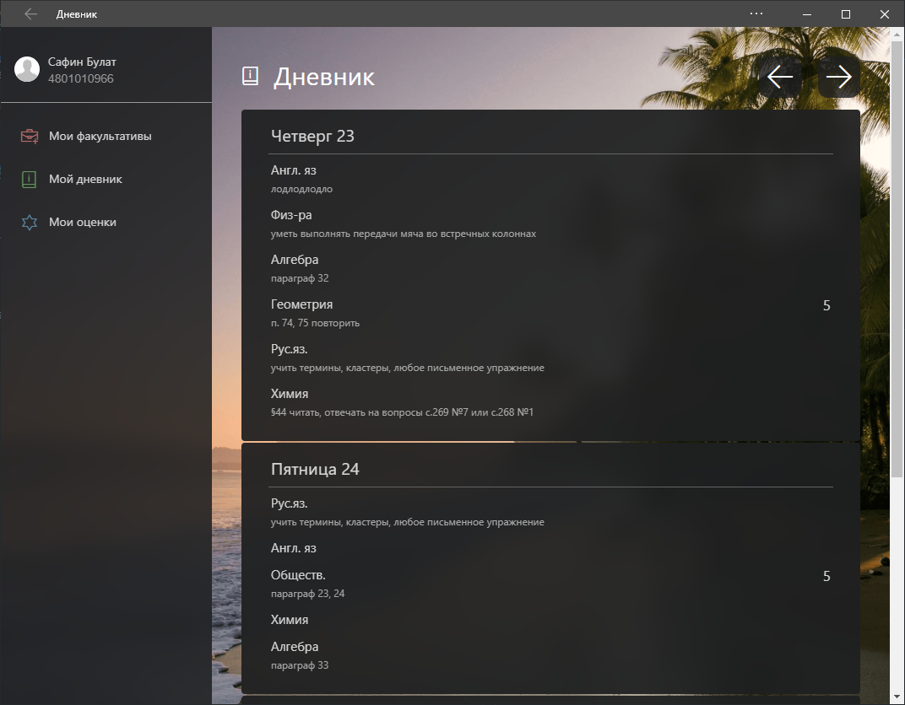

# Client for edu.tatar.ru

[edu.tatar.ru](https://edu.tatar.ru) is an education system in tatarstan.
This is a client for edu.tatar.ru with modern UI. You can try it on [carevery.ru](https://carevery.ru) (you need account on edu tatar)

## Screenshots

## Built With

* [Flask](http://www.dropwizard.io/1.0.2/docs/) - lightweight WSGI web application framework

## Authors

* **Bulat Safin** - *Initial work* - [bulatcute](https://github.com/bulatcute)

## License

This project is licensed under the MIT License - see the [LICENSE](LICENSE) file for details
